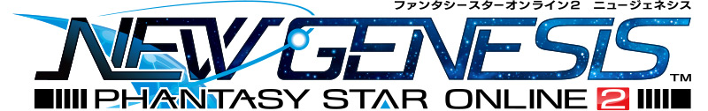

  

# NGS Thai Patch (NEKO★FAMILY X tweaker)
ยินดีต้อนรับสู่โปรเจกต์แปลภาษาไทยสำหรับเกม Phantasy Star Online 2: New Genesis (NGS) โดยความร่วมมือของทีม NEKO★FAMILY และเครื่องมือจาก Arks-Layer

Current status of tests and checks: 

โปรเจกต์นี้มีวัตถุประสงค์เพื่อแปลเนื้อหาภายในเกมจากภาษาญี่ปุ่น/อังกฤษเป็นภาษาไทย เพื่อให้ผู้เล่นชาวไทยสามารถสนุกกับเนื้อเรื่องและระบบต่างๆ ของเกมในเวอร์ชันญี่ปุ่นได้อย่างเข้าใจและมีความสุขมากที่สุด

---

## 🇹🇭 Thai Translation Team (NEKO★FAMILY)
รายชื่อผู้จัดทำและสนับสนุนหลักของโปรเจกต์เวอร์ชันภาษาไทย:

* **@พรานหม่อง (NEKO★FAMILY - SHIP4 JP)**
    * *Support:* Project Director / Coding / Tester / แปล UI / เนื้อเรื่อง
* **@Patternman (Arcane Symbol - SHIP4 JP)**
    * *Support:* แปล UI
* **@! サーティアラー ! (ต่าย) (Our Edge - SHIP4 JP)**
    * *Support:* แปล Class skill
* **Yura27B (Gemma3)**
    * *Support:* ผู้ช่วย AI ในการตรวจสอบและเรียบเรียงข้อมูล

---

## Contributions (การร่วมสนับสนุน)
### Getting Started (เริ่มต้นช่วยงานแปล)
สำหรับผู้ที่ต้องการช่วยงานแปล สามารถอ่านคู่มือการใช้งานเบื้องต้นได้ที่ [available here].

### Reporting Issues (การแจ้งปัญหา)
หากพบคำแปลผิด บั๊ก หรือข้อความแสดงผลผิดปกติ สามารถแจ้งได้ตามช่องทางนี้ครับ:

1.  **สำหรับผู้ใช้งานทั่วไป (ไทย):** หากพบภาษาไทยผิดพลาดหรืออ่านไม่รู้เรื่อง แจ้งโดยตรงได้ที่ **Discord NEKO★FAMILY** [https://discord.gg/fkjXW9AJ6a] ในห้อง `#แจ้งปัญหาการแปล`
2.  **GitHub Issues:** ส่งเรื่องผ่านระบบ GitHub โดยใส่ชื่อ Branch นำหน้า เช่น `TH_Reboot: [ชื่อปัญหา]`
3.  **Discord (Global):** สำหรับผู้ที่สื่อสารภาษาอังกฤษได้ สามารถแจ้งที่ [Phantasy Star Fleet Discord Server] ช่อง `#translation-reporting` (ต้องมี Role JP)

### Notice (ข้อควรระวัง)
* การแปลไฟล์ในโฟลเดอร์ `/Files/` **ต้อง** [ย้ายไฟล์ไปที่โฟลเดอร์ Translated](https://github.com/blog/1436-moving-and-renaming-files-on-github) ก่อนเริ่มแปลเสมอ
* รักษารูปแบบเครื่องหมายคำพูดสามอัน (`"""`) และแก้ไขเฉพาะข้อความข้างในเท่านั้น
* อ่านแนวทางการแปลและข้อควรจำได้ที่หน้า **[Wiki]**

---

## Special Thanks (ผู้มีพระคุณและผู้ริเริ่ม)
โปรเจกต์นี้เกิดขึ้นได้ด้วยการวางรากฐานและเครื่องมือที่ยอดเยี่ยมจากทีมงานอาสาสมัครต้นฉบับ:

- **Arks-Layer Team**
- CAAAAAAAAAAAW
- Blead
- frey

และสมาชิกทุกคนใน Arks-Layer ที่เปิดโอกาสให้เราได้พัฒนาโปรเจกต์ภาษาไทยต่อยอดจากฐานข้อมูลนี้

ありがとう～ (*＾▽＾)／

[Files]: https://github.com/Arks-Layer/PSO2ENPatchCSV/tree/EN_Reboot/Files
[Phantasy Star Fleet Discord Server]: https://discord.gg/pso2
[Wiki]: https://github.com/Arks-Layer/PSO2ENPatchCSV/wiki
[available here]: https://github.com/Arks-Layer/PSO2ENPatchCSV/wiki/How-to-contribute
